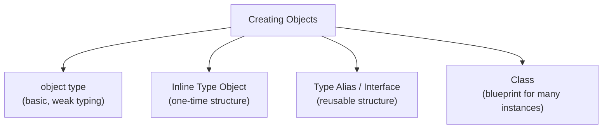

# TypeScript Objects — Guide

---

## 1. What is an Object?

- A collection of **key-value pairs**, representing real-world entities like `Employee`, `Student`, or `Product`.
- Contains two kinds of members:
  - **Properties** (variables) — e.g. `name`, `age`, `salary`.
  - **Methods** (functions attached to the object) — e.g. `getDetails()`.

```typescript
let employee = {
  name: "John",
  salary: 50000,
  job: "Engineer",
  getDetails: function () {
    return `${this.name} is a ${this.job} earning ${this.salary}`;
  }
};
```

### Accessing Properties
```typescript
employee.name;       // dot notation — most common
employee["name"];    // bracket notation
```

- Bracket notation isn't just an alternative style — it exists because dot notation only works with property names that are valid JavaScript identifiers (no spaces, no special characters, can't start with a number). Bracket notation is **required** when:
  - The key contains spaces or special characters: `employee["employee id"]`.
  - The key is stored in a **variable**, computed dynamically at runtime: `employee[someVariable]`.

```typescript
let key: string = "job";
employee[key]; // dynamic access — only possible with bracket notation
```

### Modifying Properties
```typescript
employee.job = "Manager"; // direct reassignment
```

---

## 2. `this` Inside Object Methods — A Common Trap

- Inside a regular `function` used as a method, `this` refers to the object the method was called **on**.

```typescript
let employee = {
  name: "John",
  greet: function () {
    return `Hi, I'm ${this.name}`; // 'this' = employee, correctly
  }
};
```

- The trap: if you write the method as an **arrow function** instead, `this` does **not** refer to the object — arrow functions don't have their own `this`, they inherit it from the surrounding scope where the object was defined (often the outer module or `undefined`).

```typescript
let broken = {
  name: "John",
  greet: () => {
    return `Hi, I'm ${this.name}`; // ❌ 'this' does NOT refer to 'broken' here
  }
};
```

- Rule of thumb: use regular `function` syntax for object methods that need `this`; reserve arrow functions for callbacks where you deliberately want to inherit the outer `this` (like inside class methods).

---

## 3. Different Ways to Create Objects in TypeScript



### a) Using the `object` Type

```typescript
let employee: object = { name: "John", age: 30, job: "Engineer" };
```

- This is the **weakest** form of object typing — `object` only tells TypeScript "this is some non-primitive value," without describing *what's inside it*.
- Because of that, you **can't access any specific property** on a variable typed this way — `employee.name` is a compile-time error, even though the property clearly exists at runtime, because TypeScript has no static knowledge of the shape.
- This approach is rarely useful in practice; it exists mainly as a broad category type, not a tool for everyday object typing.

### b) Inline Type Object

- The structure (shape) is defined directly at the point of creation.

```typescript
let student: {
  name: string;
  age: number;
  grade: string;
  getSummary: () => string;
} = {
  name: "Scott",
  age: 15,
  grade: "A",
  getSummary: function () {
    return `${this.name} is ${this.age} years old and scored grade ${this.grade}`;
  }
};
```

- Limitation: the type structure must be **repeated** for every object that shares this shape — no reusability.
- This is where **structural typing** first becomes visible and worth understanding properly (see Section 4).

### c) Using Type Aliases (Reusable)

```typescript
type Product = {
  name: string;
  price: number;
  getInfo: () => string;
};

let book1: Product = { name: "TS Guide", price: 499, getInfo: () => "..." };
let book2: Product = { name: "JS Guide", price: 399, getInfo: () => "..." };
```

- Solves the repetition problem — define the shape once, reuse it across any number of objects.

**Intersection types** — combine multiple type shapes into one:
```typescript
type Personal = { firstName: string; lastName: string };
type Contact = { email: string; phone: string };

type Candidate = Personal & Contact & {
  getContactInfo: () => string;
};
```
- The `&` operator means the resulting type must satisfy **all** combined shapes simultaneously — every property from every piece is required, unlike a union (`|`), which only requires satisfying *one* of the pieces.

**Interface as an alternative:**
```typescript
interface Product2 {
  name: string;
  price: number;
  getInfo(): string;
}
```
- For plain object shapes, `interface` and `type` are largely interchangeable. The practical differences: interfaces support `extends` and **declaration merging** (defining the same interface name twice merges the members), while type aliases support unions and can alias non-object types directly. For object shapes meant to be public contracts or extended later, `interface` is the more common convention.

### d) Using Classes

- A **blueprint** for creating many objects that share the same structure and behavior.

```typescript
class Person {
  constructor(
    public ssn: string,
    public firstName: string,
    public lastName: string
  ) {}

  getFullName(): string {
    return `${this.firstName} ${this.lastName}`;
  }

  getDetails(): string {
    return `SSN: ${this.ssn}, Name: ${this.getFullName()}`;
  }
}

let person1 = new Person("123", "John", "Doe");
```

- Unlike the other approaches, a class defines both **data structure and behavior together**, and produces objects via `new`, which runs the constructor logic — the other approaches just describe or assign data, with no construction step.

---

## 4. Structural Typing — Why TypeScript Compares Shapes, Not Names

- TypeScript's type system is **structural**, not nominal. This means two types are considered compatible if they have the **same shape**, even if they were declared completely separately, with different names.

```typescript
interface Point {
  x: number;
  y: number;
}

function printPoint(p: Point) {
  console.log(p.x, p.y);
}

let coord = { x: 10, y: 20, z: 30 }; // never declared as 'Point'
printPoint(coord); // ✅ Works — shape matches (has x and y)
```

- This is fundamentally different from languages like Java or C#, where a class must **explicitly** declare `implements SomeInterface` to be treated as that type. TypeScript never checks declared relationships — only whether the actual properties line up.
- This is also why the `object` type from Section 3a is nearly useless for practical typing — it defines no shape at all, so there's nothing for structural comparison to check against.

### Excess Property Checks — a well-known exception
- Normally, having *extra* properties beyond what's required is fine structurally (as shown above with `coord`). But TypeScript applies a **stricter check specifically to object literals assigned directly**, catching likely typos.

```typescript
function printPoint(p: Point) { /* ... */ }

printPoint({ x: 10, y: 20, z: 30 }); // ❌ Error — excess property 'z' on a direct literal
printPoint(coord);                    // ✅ Works — same shape, but passed via a variable
```

- The difference: passing an object **literal directly** triggers excess property checking (since it's assumed you'd want to know about a likely mistake immediately), while passing a **pre-existing variable** with the same excess properties does not — TypeScript assumes the variable might be legitimately reused elsewhere with its extra properties intact.
- This inconsistency is intentional, but frequently surprises developers who expect the two cases to behave identically.

---

## 5. Optional, Readonly & Dynamic Properties

```typescript
type Config = {
  readonly id: number;      // cannot be reassigned after the object is created
  name: string;
  description?: string;     // optional — may be omitted entirely
  [key: string]: unknown;   // index signature — allows any additional string key
};
```

- `readonly` — enforced only at **compile time**; it has no effect at runtime, and can technically still be bypassed via type assertions or `JSON.parse`/reconstruction.
- `?` (optional) — means the property might be `undefined`. Accessing it without a check requires **optional chaining** (`config.description?.length`) to avoid a runtime error if it's missing.
- **Index signatures** (`[key: string]: type`) — used when an object's keys aren't known in advance (e.g. a dictionary/lookup object), allowing any string key as long as its value matches the declared type.

---

## 6. Copying & Destructuring Objects

```typescript
let original = { name: "Alice", age: 25 };

// Shallow copy via spread
let copy = { ...original };
copy.name = "Bob";       // original.name is unaffected

// Destructuring — extract properties into standalone variables
let { name, age } = original;
```

- The spread operator (`{...obj}`) only performs a **shallow copy** — top-level properties are copied independently, but if a property's value is itself an object, both the original and the copy still point to the **same nested object** in memory. Modifying a nested property through the copy will also affect the original.

```typescript
let user = { name: "Alice", address: { city: "Delhi" } };
let userCopy = { ...user };
userCopy.address.city = "Mumbai";
console.log(user.address.city); // "Mumbai" — the nested object was shared, not copied
```

- Achieving a true independent copy of nested data (**deep copy**) requires a dedicated approach — `structuredClone(obj)` (modern, built-in), a recursive copy function, or a library like Lodash's `cloneDeep`.

---

## 7. Useful Built-in Object Methods

| Method | Description | Example |
|---|---|---|
| `Object.keys(obj)` | Returns an array of the object's own property names | `Object.keys({a:1,b:2})` → `["a","b"]` |
| `Object.values(obj)` | Returns an array of the object's own values | `Object.values({a:1,b:2})` → `[1,2]` |
| `Object.entries(obj)` | Returns an array of `[key, value]` tuples | `Object.entries({a:1})` → `[["a",1]]` |
| `Object.assign(target, source)` | Copies properties from source(s) into target (shallow, mutates target) | `Object.assign({}, obj1, obj2)` |
| `Object.freeze(obj)` | Prevents adding/removing/reassigning top-level properties (shallow) | `Object.freeze(config)` |
| `Object.keys(obj).length` | Common pattern to count an object's properties | — |

```typescript
let scores = { math: 90, science: 85 };
for (const [subject, score] of Object.entries(scores)) {
  console.log(`${subject}: ${score}`);
}
```

---

## Comparison Table — Object Creation Approaches

| Approach | TypeScript Support | Reusability | Recommended For |
|---|---|---|---|
| `object` type | Basic, weak | None | Rarely — avoid where possible |
| Inline type object | Strong | None | Small, one-time objects |
| Type alias | Strong | Reusable | Multiple objects sharing a shape |
| Interface | Strong | Reusable, extendable | Public contracts, shapes meant to be extended |
| Class | Strong | Reusable, instantiable | Object-oriented designs, many similar instances with behavior |

---

## Q&A

**Q1. What is an object in TypeScript, and what two kinds of members can it contain?**

A:
- A collection of key-value pairs representing a real-world entity.
- It can contain properties (variables holding data) and methods (functions attached to the object that operate on that data).

**Q2. When is bracket notation required instead of dot notation for accessing a property?**

A:
- When the property name contains spaces or special characters that aren't valid identifiers.
- When the property name is stored in a variable and needs to be accessed dynamically at runtime.
- Dot notation only works with property names known and valid at write-time.

**Q3. Why does `this` behave differently when an object's method is written as an arrow function instead of a regular function?**

A:
- Arrow functions don't have their own `this` — they inherit it from the surrounding scope where they were defined, not from how they're called.
- A regular function used as a method gets `this` bound to whatever object it's called on.
- So an arrow function as a method usually fails to reference the object itself through `this`.

**Q4. Why is the `object` type considered a weak way to type an object in TypeScript?**

A:
- It only communicates "this is a non-primitive value" without describing its actual shape.
- Because no shape is known, you can't access any specific property on a variable typed this way without a compile error or a type assertion.
- It's rarely useful compared to inline types, type aliases, or interfaces, which describe the actual structure.

**Q5. What is structural typing, and how is it different from the typing systems in languages like Java?**

A:
- TypeScript compares types based on their **shape** — the properties and methods they contain — not on declared names or explicit relationships.
- An object can satisfy an interface it was never declared to implement, as long as its shape matches.
- In nominally-typed languages like Java, a class must explicitly declare `implements SomeInterface` to be treated as that type — the relationship must be declared, not just inferred from shape.

**Q6. What is an excess property check, and why does it behave differently for object literals vs variables?**

A:
- When an object literal is passed **directly** to a function or assigned directly to a typed variable, TypeScript strictly checks for any extra properties not defined in the target type, and errors if found — this catches likely typos.
- When the same-shaped object is stored in a variable first and then passed, this strict check doesn't apply — only the required properties are checked, extras are allowed.
- This inconsistency is intentional: direct literals are assumed to be a mistake if they have unexpected extra fields, while variables might legitimately carry extra properties used elsewhere.

**Q7. What is the difference between a `readonly` property and an actual runtime-immutable property?**

A:
- `readonly` is a compile-time-only guarantee — TypeScript's compiler blocks reassignment during static analysis, but the restriction doesn't exist once the code is compiled to JavaScript.
- It can be bypassed at runtime through type assertions or by rebuilding the object through mechanisms TypeScript doesn't track.
- True runtime immutability requires something like `Object.freeze()`, though that's also only shallow by default.

**Q8. What is an index signature, and when would you use one?**

A:
- Syntax like `[key: string]: type` that allows an object to have any number of additional keys of a specified type, when the exact key names aren't known in advance.
- Useful for dictionary-like or lookup objects, e.g. mapping usernames to user records where the set of usernames isn't fixed.

**Q9. Why does copying an object with the spread operator (`{...obj}`) sometimes still let changes affect the "original" object?**

A:
- The spread operator performs a shallow copy — only top-level properties are duplicated independently.
- If a property's value is itself an object, both the original and the copy still reference the exact same nested object in memory.
- Modifying that nested object through either reference affects both, since there's really only one nested object shared between them.

**Q10. How would you create a true deep copy of an object with nested data?**

A:
- Use the built-in `structuredClone(obj)` function, which performs a full deep clone natively.
- Alternatively, write a recursive copying function, or use a library utility like Lodash's `cloneDeep`.
- A shallow method like spread or `Object.assign()` is not sufficient whenever nested objects are involved.

**Q11. What's the practical difference between an interface and a type alias when describing an object's shape, and when would you choose one over the other?**

A:
- Both can describe an object's shape almost identically for basic cases.
- Interfaces support `extends` and declaration merging (redeclaring the same interface name adds to it); type aliases support unions and can alias primitive or non-object types directly.
- Convention: use `interface` for public contracts or shapes expected to be extended by others; use `type` for unions, intersections, or more complex compositions.

**Q12. In a real project, why might a class be preferred over a type alias for representing something like an `Employee`?**

A:
- A type alias only describes the shape of the data — it doesn't provide a way to construct objects consistently or attach reusable behavior.
- A class combines the data shape with behavior (methods) and a constructor, ensuring every instance is created consistently and can share logic like validation or computed properties.
- Type aliases are better suited for simple data-only structures (like API response shapes); classes are better when the object needs both structure and consistent, reusable behavior across many instances.
